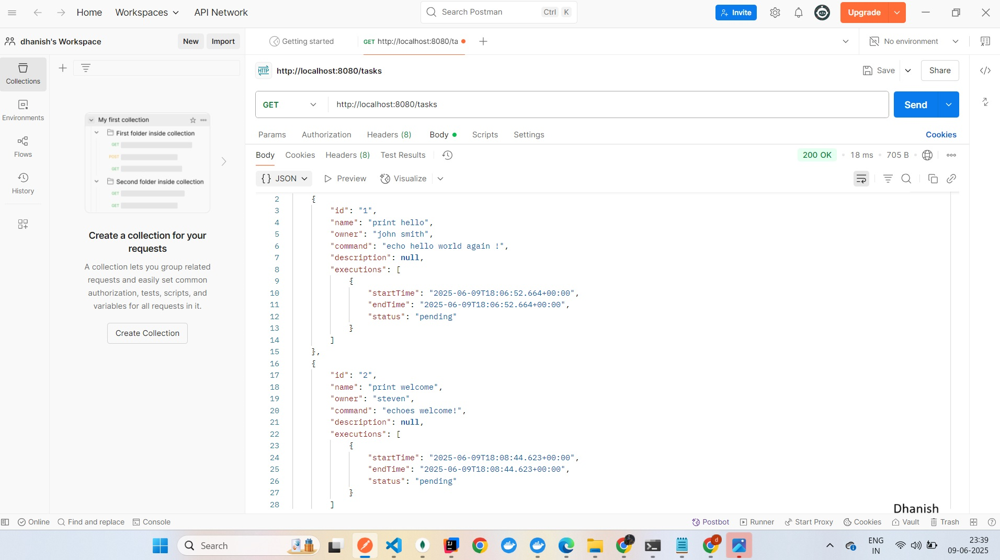

# Kaiburr Task 1 - Java Backend REST API

This repository contains my implementation of **Task 1** for Kaiburr’s assessment — a Java Spring Boot REST API that manages tasks and executes shell commands inside Kubernetes pods.

---

## 📁 Project Overview

- **Backend**: Java Spring Boot application
- **Database**: MongoDB
- **Features**:
  - Create, update, delete, and search tasks
  - Execute commands in a Kubernetes pod

---

## 🚀 Running the Application

1. Make sure **MongoDB** is running locally (default port: 27017).
2. Update `application.properties` if needed:

    ```properties
    spring.data.mongodb.uri=mongodb://localhost:27017/kaiburr
    ```

3. Build and run the app:

    ```bash
    mvn spring-boot:run
    ```

4. The API will be available at:

    ```
    http://localhost:8080/tasks
    ```

---

## 🧪 API Endpoints

| Method | Endpoint                      | Description                                        |
|--------|-------------------------------|----------------------------------------------------|
| GET    | /tasks                        | Get all tasks or a specific task by ID             |
| PUT    | /tasks                        | Create or update a task                            |
| DELETE | /tasks/{id}                   | Delete a task by ID                                |
| GET    | /tasks/search?name=xyz        | Search tasks by name                               |
| PUT    | /tasks/{id}/execute           | Execute the command in a Kubernetes pod (busybox)  |

---

## 📸 Screenshots

✅ The following screenshots include the **date/time and my name** to verify authenticity.

### 🔎 GET all tasks


### ✏️ PUT a task


### 🗑️ DELETE a task


### 🔍 Search tasks by name


### ⚡ Execute a task in Kubernetes pod


---

## 📦 Deployment

This project is also containerized and deployed to Kubernetes as part of **Task 2**.  
Please refer to the **Task 2** repository for deployment manifests and Kubernetes setup.

---

✅ **Task 1 complete!**  
**Author**: Dhanish  
**Date**: 2025
